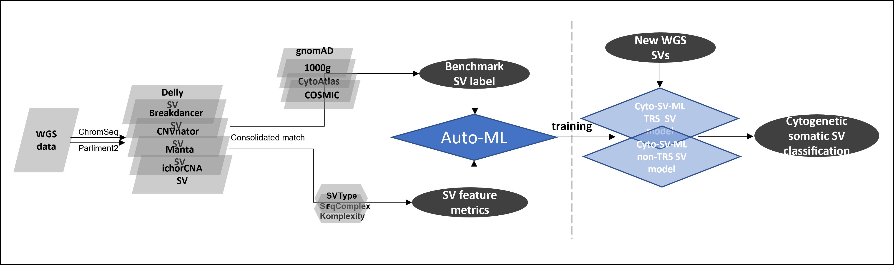
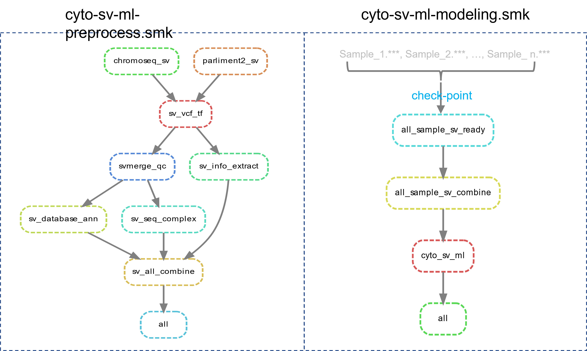

# CYTO-SV-ML
#### CYTO-SV-ML pipeline design:


### CYTO-SV-ML snakemake workflow


### conda environment setup
```
mkdir -p ~/miniconda3
wget https://repo.anaconda.com/miniconda/Miniconda3-latest-Linux-x86_64.sh -O ~/miniconda3/miniconda.sh
bash ~/miniconda3/miniconda.sh -b -u -p ~/miniconda3
rm -rf ~/miniconda3/miniconda.sh
~/miniconda3/bin/conda init bash
~/miniconda3/bin/conda init zsh
conda update conda # in case that conda version is old
conda install -n base -c conda-forge mamba
```

### Download parliament and chromoseq Docker
```
sudo yum install -y yum-utils
sudo yum-config-manager --add-repo https://download.docker.com/linux/centos/docker-ce.repo
sudo yum install docker-ce docker-ce-cli containerd.io
sudo systemctl start docker
sudo docker pull docker.io/dnanexus/parliament2:latest # Parliament: https://github.com/dnanexus/parliament2
sudo docker pull  docker.io/zatawada/docker-basespace_chromoseq_v2:master # ChromoSeq: https://github.com/genome/docker-basespace_chromoseq
```

### Install CYTO-SV-ML Snakemake pipeline
```
git clone https://github.com/tzhang-nmdp/CYTO-SV-ML.git
cd CYTO-SV-ML
mamba env create py27 -f py27.yaml
mamba env create cyto-sv-ml -f cyto-sv-ml.yaml
pip install --upgrade snakemake # in case that snakemake version is old
```

### Download hg38 reference genome 
```
# hg38 from Broad Institute Google Cloud (https://console.cloud.google.com/storage/browser/genomics-public-data/resources/broad/hg38/v0/)
CYTO-SV-ML/reference/hg38/hs38.fasta
CYTO-SV-ML/reference/hg38/hs38.fasta.fai
# VEP GRCh38 from ensembl
cd CYTO-SV-ML/reference
curl -O https://ftp.ensembl.org/pub/release-108/variation/vep/homo_sapiens_vep_104_GRCh38.tar.gz
tar xzf homo_sapiens_vep_104_GRCh38.tar.gz
cd CYTO-SV-ML/reference/homo_sapiens/104_GRCh38
```

### Run CYTO-SV-ML Snakemake preprocess pipeline
Please change the config.yaml according to your own environment settings:                                                    
{your_work_dir} for input/output dir                                                  
{cyto_sv_ml_dir} for cyto_sv_ml dir and software subdir and reference subdir
```
conda activate cyto-sv-ml
snakemake --core ${number_of_cores} -s cyto-sv-ml-preprocess.smk --use-conda --config sample=${sample} gender=${gender}
```
### Run CYTO-SV-ML Snakemake modeling pipeline
```
snakemake --core ${number_of_cores} -s cyto-sv-ml-modeling.smk  --config cohort_name=${cohort_name}
snakemake --core ${number_of_cores} -s cyto-sv-ml-modeling.smk --report ${out_dir}/${cohort_name}_report.html
```

# Run Shiny Web-portal 
The analysis summary of 494 MDS cohort using CYTO-SV-ML pipeline 
### Install Shiny Web-portal
```
cd CYTO-SV-ML
docker build -t CYTO-SV-ML:main .
```

### Start Shiny Web-portal
```
docker run -d -p 8000:80  CYTO-SV-ML:main
```

### open Shiny Web-portal
```
http://127.0.0.1:8000/ # in a web browser 
```

### Online Web-portal
http://cyto-sv-ml.b12x.org/


# SV Related Resource Download

## SV database Download (The official websites contain detailed information)
```
gnomAD: https://gnomad.broadinstitute.org/downloads
1000g: https://www.internationalgenome.org/phase-3-structural-variant-dataset
CytoAtlas: https://github.com/genome/docker-basespace_chromoseq/blob/master/workflow_files/chromoseq_translocations.bedpe
COSMIC: https://cancer.sanger.ac.uk/cosmic/download
```

## SV Tool Download
```
SURVIVOR: https://github.com/fritzsedlazeck/SURVIVOR
SVTyper: https://github.com/hall-lab/svtyper
SeqComplex: https://github.com/caballero/SeqComplex
Komplexity: https://github.com/eclarke/komplexity
```

## ML Pipeline Download
```
AUTOML: https://github.com/mljar/mljar-supervised
```
